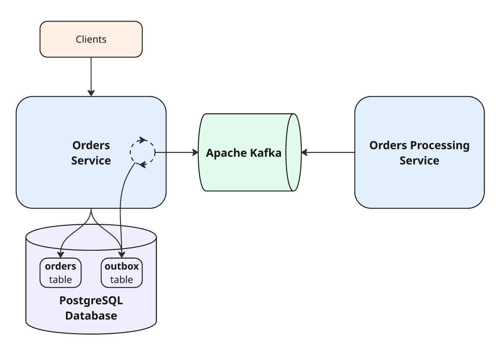

# Transactional Outbox Pattern Example

The project that implements [**Transactional Outbox** pattern](https://microservices.io/patterns/data/transactional-outbox.html) based on a service that accepts user orders

## Components

1. **PostgreSQL** database
2. **Orders** Microservice
3. **Apache Kafka** Message Broker

## Technologies and Tools

- [x] **Java 25**
- [x] **Spring Boot** 4.0.4
- [x] **PostgreSQL** Database
- [x] **Apache Kafka** Message Broker
- [x] **Kafka UI**
- [x] **Docker** containerization with **Docker Compose**
- [x] **Flyway** Database Migration Tool
- [x] **MapStruct** for objects mapping
- [x] **GitHub Actions** for CI
- [x] **Swagger** for API documentation
- [x] Unit and Integration tests with
    - **Testcontainers**
    - **SpringBootTest**, **MockMvc**
    - **JUnit**, **Mockito**, **AssertJ**

## Running the System using the Docker Compose tool

In order to run the system it is necessary to build Orders Microservice first:
> mvn clean package

Then the Docker images can be built:
> docker compose build [--no-cache]

And the full System can be launched:
> docker compose up -d

To shut down the system, run:
> docker compose down

## API

### Docs
Swagger API documentation is available under  
> localhost:8080/api/v1/swagger-ui/index.html

### Kafka UI
> localhost:8083
